# numpy 워밍업


## 문제 1 

- 코드


```a = np.random.rand(1000000)
b = np.random.rand(1000000)

tic_dot = time.time()
c_dot = np.dot(a,b)
toc_dot = time.time()

print("np.dot을 통한 결과값: ",c_dot)
print("넘파이 dot 걸린 시간: " + str(1000*(toc_dot-tic_dot))+" ms")

c_for=0
tic_for = time.time()
for i in range(1000000):
    c_for += a[i]*b[i]
toc_for = time.time()

print("for을 통한 결과값: ",c_for)
print("for loop 걸린 시간: " + str(1000*(toc_for-tic_for))+" ms")
print(c_dot==c_for)
print(np.allclose(c_dot,c_for))
```

- for과 np.dot 걸린 시간 비교 

| 방법 | 소요시간 | 배수 |
| --- |  --- | --- |
| np.dot | 10.07 | 1배 |
| for loop | 155.92 | 15배 |

for의 경우에는 넘파이 라이브러리와 파이썬 사이에 데이터를 추가적으로 처리하는 오버헤드가 존재하지만 
넘파이 dot의 경우에는 c 언어 안에서만 연산을 진행하여 오버헤드가 없다는 차이점을 가진다.


-  결과값 비교 

| 방법 | 결과값 | 
| --- |  --- | 
| np.dot | 249917.35091018977 | 
| for loop | 249917.35091018115 | 

- 정확히 같지 않은 이유 

내부 연산 과정에서 순서가 다르게 되는데 이로 인해 컴퓨터 상에 부동 소수점 연산과정에서의
반올림이 달라지게 되면서 오차가 생길 수 있다.

## 문제 2

- 코드

```
a=np.random.rand(3, 4)
column_sum=0
print("열 정규화 keepdims False 결과값: \n",a/a.sum(axis=0,keepdims=False))
print("열 정규화 keepdims True 결과값: \n",a/a.sum(axis=0,keepdims=True))
print("각 열의 합: ",(a/a.sum(axis=0,keepdims=True)).sum(axis=0,keepdims=True))
print("각 열 검사:", np.isclose((a/a.sum(axis=0,keepdims=True)).sum(axis=0,keepdims=True), 1))

#print("행 정규화 keepdims False 결과값: \n",a/a.sum(axis=1,keepdims=False))
print("행 정규화 keepdims True 결과값: \n",a/a.sum(axis=1,keepdims=True))
print("각 행의 합: ",(a/a.sum(axis=1,keepdims=True)).sum(axis=1,keepdims=True))
print("각 열 검사:", np.isclose((a/a.sum(axis=1,keepdims=True)).sum(axis=1,keepdims=True), 1))

```

<br>
<br>

- 각 열 정규화한 결과값(keepdims=True)

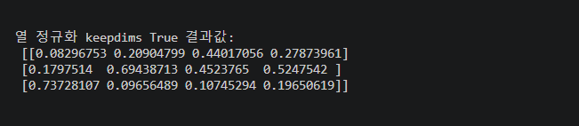

- 각 열 정규화한 결과값(keepdims=False)

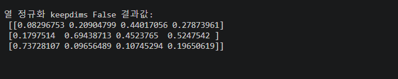

- 각 열의 값의 합 

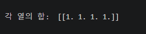


- 각 행 정규화한 결과값(keepdims=True)

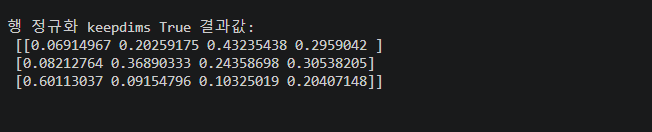

- 각 행 정규화한 결과값(keepdims=False)

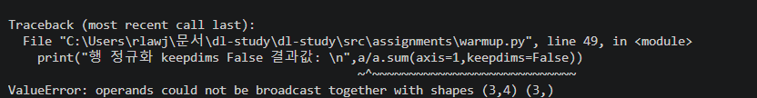


- 각 행의 값의 합

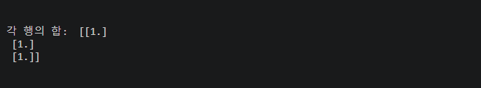

## 문제 3

- 코드

```
a = np.random.randn(5)
b = np.random.randn(5, 1)
print("a.shape: " ,a.shape , "b.shape: ", b.shape)
print("a.T.shape: " ,a.T.shape , "b.T.shape: ", b.T.shape)
print("np.dot(a, a.T): ",np.dot(a, a.T),"np.dot(b, b.T): ", np.dot(b, b.T))
```

- a,b shape

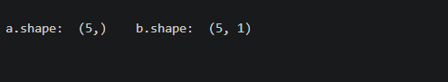

- a.T.shpae , b.T.shape

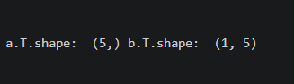

- a.dot 

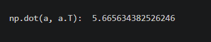

- b.dot

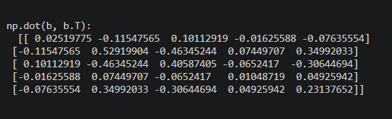


## 문제 4

- relu 함수가 꺽이는 위치 

>    ```
>    def relu(x):
>        x=np.maximum(0,x)
>        return x 
>    ```


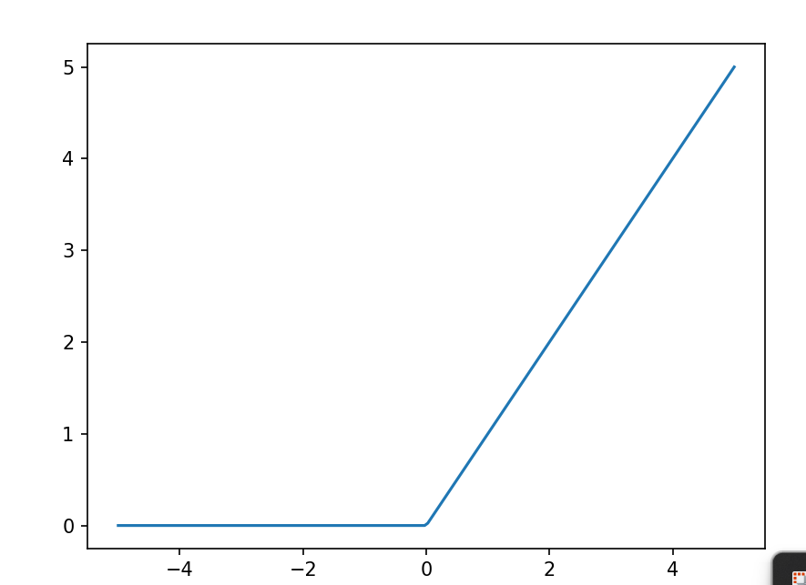


relu 함수는 y값이 0이 되는 지점에서 꺽이게 된다. relu는 활성화 함수로 사용될 때 식은 다음과 같다.

$$
y = \mathrm{ReLU}(wx+b)
$$

여기서 relu는 w*x + b이 0이 되는 지점에서 꺽이기에 다음과 같이 전개하여 0이 되는 x 지점을 구할 수 있다

$$
wx+b=0
$$

$$
x=-\frac{b}{w}
$$

<br>
<br>


- relu sum 그림

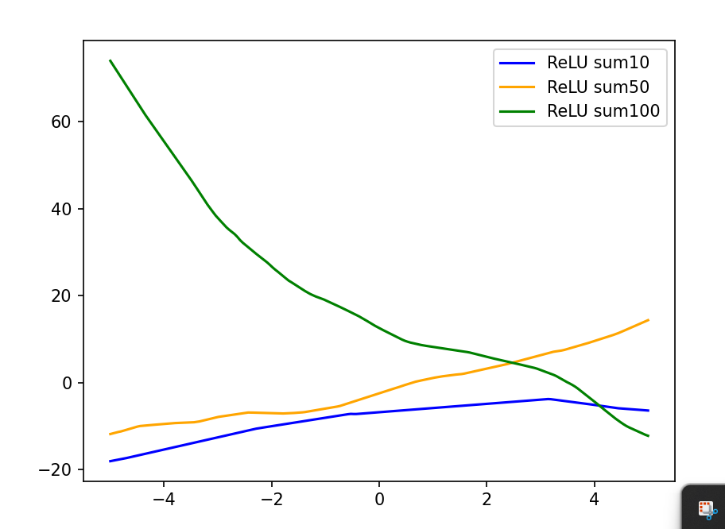

relu 함수를 더한 결과는 비선형 함수로 나온다.

<br>
<br>


- linear sum 그림

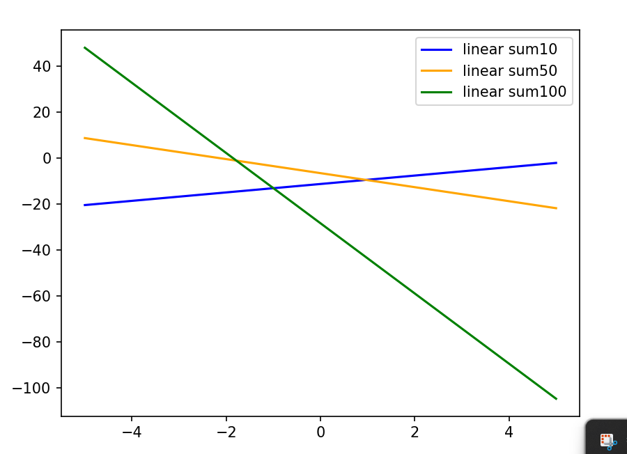

linear 함수 자체를 여러번 더해도 결국 선형성을 띄기에 직선 형태를 가진다.

<br>
<br>


- 활성화 함수의 역활

활성화 함수는 입력 값으로 가중치를 곱한 뒤에 비선형 함수를 만드는 역활을 한다.


## 문제 5

- lstsq


- n=10일 때 y_pred

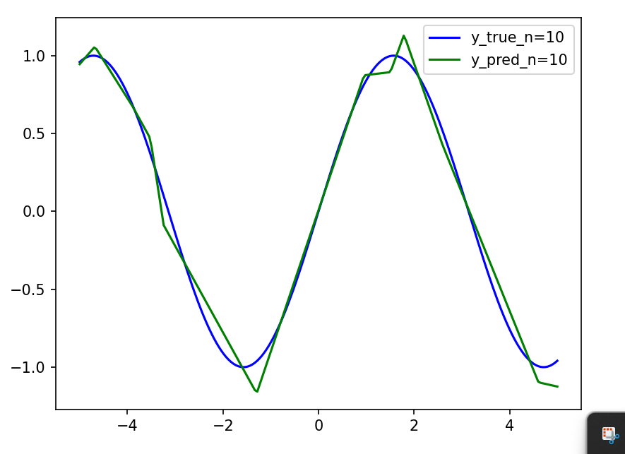

- n=20일 때 y_pred

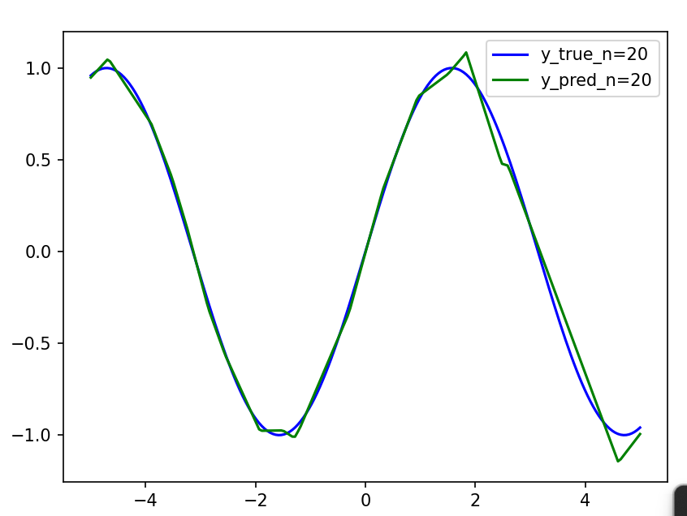

- n=100일 때 y_pred

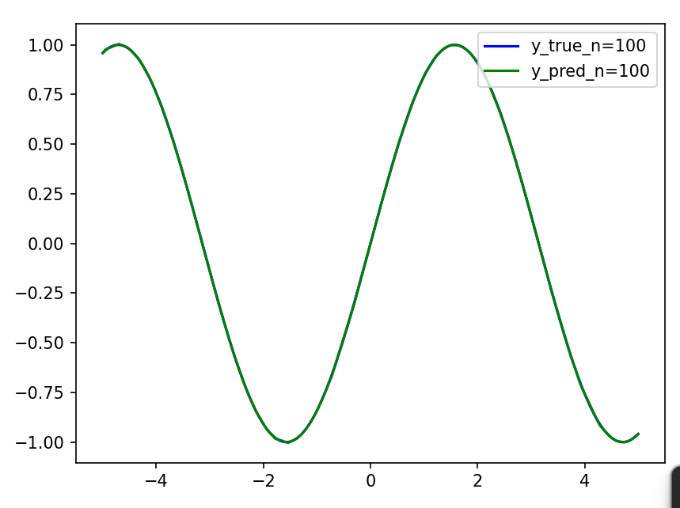

<br>
<br>


- 실제 신경망 학습과 차이:

## 막혔던 것 

## 아직 모르겠는 것