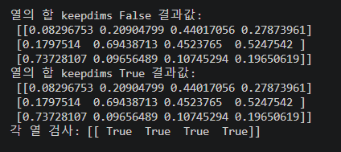
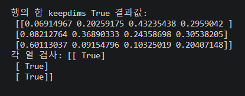

# 과제 numpy 워밍업


## 문제 1 

코드:


```a = np.random.rand(1000000)
b = np.random.rand(1000000)

tic_dot = time.time()
c_dot = np.dot(a,b)
toc_dot = time.time()

print("np.dot을 통한 결과값: ",c_dot)
print("넘파이 dot 걸린 시간: " + str(1000*(toc_dot-tic_dot))+" ms")

c_for=0
tic_for = time.time()
for i in range(1000000):
    c_for += a[i]*b[i]
toc_for = time.time()

print("for을 통한 결과값: ",c_for)
print("for loop 걸린 시간: " + str(1000*(toc_for-tic_for))+" ms")
print(c_dot==c_for)
print(np.allclose(c_dot,c_for))
```


| 방법 | 소요시간 | 배수 |
| --- |  --- | --- |
| np.dot | 10.07 | 1배 |
| for loop | 155.92 | 15배 |

for의 경우에는 넘파이 라이브러리와 파이썬 사이에 데이터를 추가적으로 처리하는 오버헤드가 존재하지만 
넘파이 dot의 경우에는 c 언어 안에서만 연산을 진행하여 오버헤드가 없다는 차이점을 가진다.


-  결과값 비교 

| 방법 | 결과값 | 
| --- |  --- | 
| np.dot | 249917.35091018977 | 
| for loop | 249917.35091018115 | 

- 정확히 같지 않은 이유 
내부 연산 과정에서 순서가 다르게 되는데 이로 인해 컴퓨터 상에 부동 소수점 연산과정에서의
반올림이 달라지게 되면서 오차가 생길 수 있다.

## 문제 2


```a=np.random.rand(3, 4)
column_sum=0
print("열의 합 keepdims False 결과값: \n",a/a.sum(axis=0,keepdims=False))
print("열의 합 keepdims True 결과값: \n",a/a.sum(axis=0,keepdims=True))
print("각 열 검사:", np.isclose((a/a.sum(axis=0,keepdims=True)).sum(axis=0,keepdims=True), 1))
print("\n\n\n\n\n")

#print("행의 합 keepdims False 결과값: \n",a/a.sum(axis=1,keepdims=False))
print("행의 합 keepdims True 결과값: \n",a/a.sum(axis=1,keepdims=True))
print("각 열 검사:", np.isclose((a/a.sum(axis=1,keepdims=True)).sum(axis=1,keepdims=True), 1))
```

각 열의 합으로 나누어 정규화한 결과값 및 각 열의 합



각 열의 합으로 나누어 정규화한 결과값 및 각 행의 합
